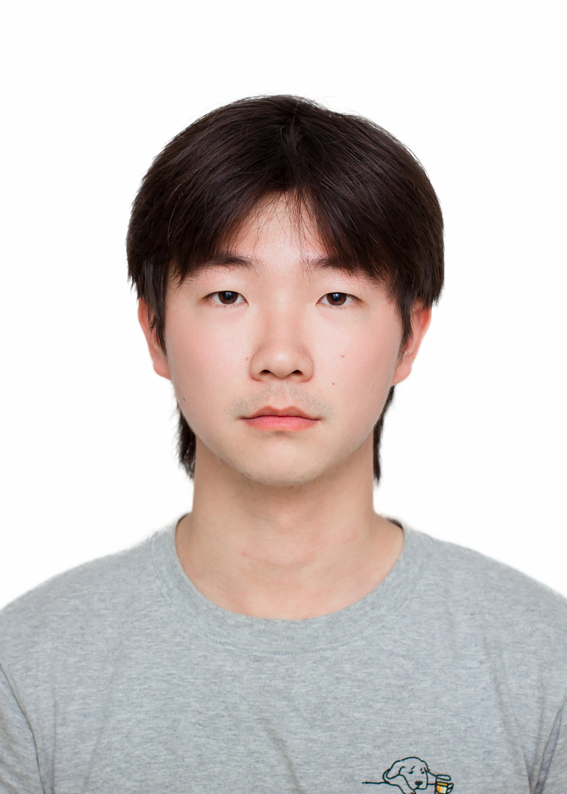

<h1> Hi, I'm Hongbin Na </h1>

I'm an a first-year Master of Research student in [Australian AI Institute](https://www.uts.edu.au/research/australian-artificial-intelligence-institute) at  [University of Technology Sydney](https://www.uts.edu.au/), affiliated with the [UTS NLP Group](https://utsnlp.github.io/), where I am advised by [Ling Chen](https://profiles.uts.edu.au/Ling.Chen) (UTS), supervised by [Tao Shen](https://scholar.google.com/citations?user=SegyX9AAAAAJ&hl=en) (Oracle) and work closely with [Yining Hua](https://ningkko.github.io/) and [John Torous](https://corporatelearning.hms.harvard.edu/faculty-staff/john-torous) (Harvard), and also guided by [Irene Li](https://ireneli.eu/) (UTokyo).

My research interests focus on the field of Natural Language Processing (NLP), specifically in dialogue systems and mental health. My goal is to combine psychology with large language models (LLMs) to explore and develop models capable of understanding complex human emotions and cognitive processes. If you’re interested in working with me, please feel free to send an email.

<picture>
  <!-- <source srcset='/images/dominik_berlin.webp' type='image/webp' /> -->
  
</picture>

{:.no-list}
* <a href="mailto:{{ site.email }}">{{ site.email }}</a>

## News

<ul>

  

</ul>

## Travel

<table>
<tbody>


  



  

</tbody>
</table>

